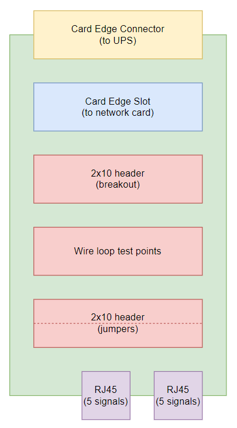

# Spork

Spork is an interposer that sits between a real network card and the UPS, making it easier to hook into the electrical signals with an oscilloscope or other test equipment. It has no functionality of its own - it is simply an electrical pass-through with test points.

The point of the Spork board is convenience. Needing to work on a partially disassembled UPS and reach around the back of my server rack makes working on the project far more of a hassle than it needs to be. Breaking those signals out externally is a better solution.

It is important to note that the Spork allows for reverse engineering of both the network card and the UPS. One of the most important capabilities will be to emulate the UPS, in order to analyse the behaviour of the Network-MS card so that it can be replicated for interoperability.

Spork is made up of two identical PCBs connected via standard Cat5/6 network cables. One board plugs into the UPS, passing the signals out through the RJ45 connectors. The original face plate from the network card is attached to this board, to provide mechanical strength. The other board breaks out the signals and provides a card edge slot for the original network card to plug into.

Spork will provide the following breakout options:

- Wire loops for connecting scope probes.
- 2x10 header (both pins connected) for convenient breakout.
- 2x10 header (jumpers separating board connections and RJ45 connectors) for in-place signal tampering and optional signal disconnection.

Here's an overview of the card layout:

While the older Network-MS card interface has only 6 pins, which could be transported over just one cable, the newer Network-M2 card has 10 pins (5 per side) on the same card-edge form factor. The cost and inconvenience of using two cables is far outweighed by the benefit of having a design that works with newer cards as well as older ones.

Using just 5 signals per cable has some advantages, too. The swapped pair (see DB in the [TIA-568 Wikipedia article](https://en.wikipedia.org/wiki/ANSI/TIA-568#Wiring)) doesn't need to be accounted for, since we can just use the DA, DC, and DD pairs. Signal referencing can be improved with some basic preliminary reverse engineering, to identify the ground and power lines and ensure that they are coupled with signal lines where possible.

## Revision 1

As of 2021-05-24 there is a now a revision 1 design of this board.

Final checks are underway before sending this to production.